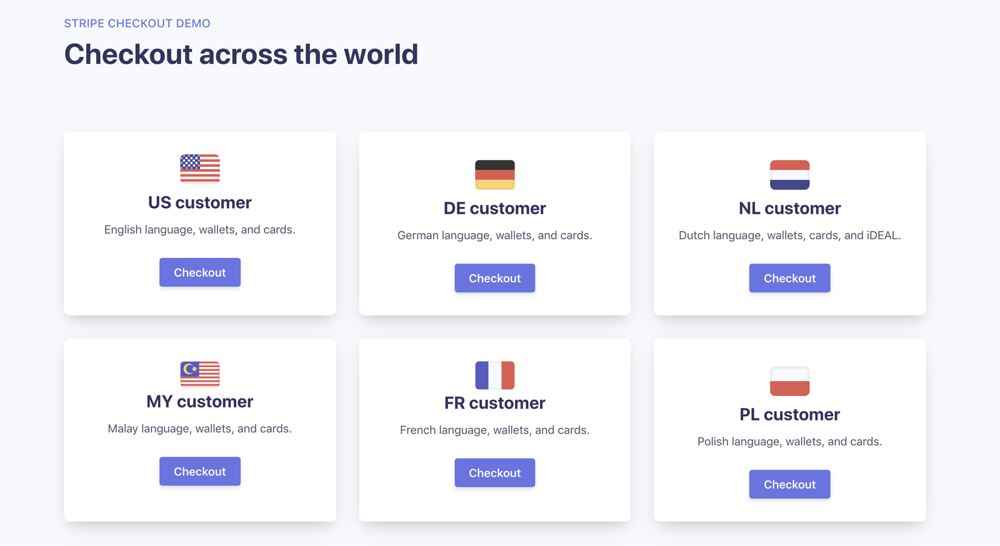

# Sales demo of Stripe Checkout

Sales demo of Stripe Checkout with different locales around the world. 



This demo shows you how to easily create a checkout session to see what Checkout might look like for customers from around the world:

- US: English; USD; cards, Apple Pay & Google Pay
- DE: German; EUR; cards, Apple Pay & Google Pay Giropay
- NL: Dutch; EUR; cards, Apple Pay & Google Pay, iDEAL
- MY: Malay; MYR; cards, Apple Pay & Google Pay 
- BE: French; EUR; cards, Apple Pay & Google Pay, Bancontact
- PL: Polish; PLN; cards, Apple Pay & Google Pay, P24

## How to run locally

```
git clone git@github.com:stripe-samples/checkout-with-multiple-locales.git
npm install
npm start
```
